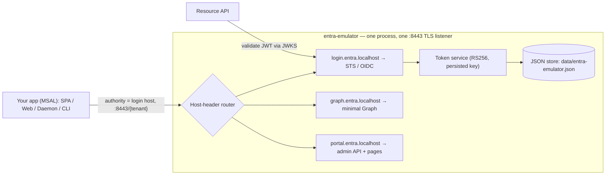

# Architecture

> Entra Emulator is a local, MSAL-compatible emulator of Microsoft Entra ID in Go —
> an independent, clean-room implementation of Microsoft's publicly documented
> identity platform v2.0 protocol surface. It exposes the OIDC/OAuth 2.0 endpoints
> MSAL talks to, a minimal read-only Microsoft Graph, and an unauthenticated admin
> REST API — one process, one HTTPS listener.

## Goals

1. **MSAL compatibility first.** An MSAL app pointed at the emulator's authority works
   with configuration changes only.
2. **Standards-correct tokens.** Real RS256-signed JWTs, verifiable against a working
   JWKS endpoint, with Entra v2.0 claim shapes (`tid`, `oid`, `scp`/`roles`, `ver`).
3. **Zero-friction setup.** `go build` produces a single static binary; first run
   self-generates a TLS cert and a deterministic seed directory.
4. **Inspectable & resettable.** Admin API to list/create/reset everything; fixed seed
   GUIDs and secrets for reproducible CI.

**Non-goals**: no multi-tenant, implicit flow, ROPC, OBO, SAML, MFA/Conditional
Access/consent, certificate client auth, or Graph writes (several are roadmap items —
docs/10). This is a development tool — intentionally insecure (open admin API, seeded
public secrets, self-signed TLS).

## Implementation choices

| Concern | Choice | Why |
|---|---|---|
| Runtime | Single static Go binary, stdlib `net/http` | The stdlib covers the whole surface; trivial cross-compilation |
| Persistence | SQLite via `modernc.org/sqlite` (pure Go — no cgo) | Standard file format, SQL migrations, static binary preserved |
| JWT/crypto | `crypto/rsa` + hand-rolled compact JWS (RS256 only) | One algorithm, ~100 lines, no dependency |
| Admin portal | Svelte SPA (Vite build), assets embedded via `go:embed` | Small bundle; Node needed only when changing the portal — the shipped binary stays self-contained |
| Validation | Plain Go validation funcs | — |
| Password hashing | scrypt (`golang.org/x/crypto/scrypt`) | Only non-stdlib dependency besides the SQLite driver |

Everything protocol-visible — paths, parameters, claim shapes, error bodies,
lifetimes — follows Microsoft's published Entra ID v2.0 behavior so MSAL clients and
resource APIs cannot tell the difference.

## Process shape



Three surfaces share one HTTPS listener, routed by `Host` header. The
`localhost`/`127.0.0.1` origin is a backward-compat host serving **every** route
(`ORIGIN_MODE=compat` collapses all advertised origins onto it — the default when the
subdomains can't resolve, e.g. in a container).

## Package layout

```
entra-emulator/
├── cmd/entra-emulator/     main: flags/subcommands, boot sequence
├── internal/
│   ├── config/             env → JSON file → defaults; validation
│   ├── store/              entities, SQLite persistence + migrations, seed,
│   │                       scrypt/SHA-256 hashing
│   ├── tokens/             RSA key mgmt, JWKS, RS256 JWS, claim assembly,
│   │                       auth-code / refresh-token / device-code issuance
│   ├── identity/           discovery, authorize + sign-in page, token grants,
│   │                       devicecode, userinfo, logout
│   ├── graph/              /v1.0 me/users/groups (+ bearer validation)
│   ├── admin/              /admin/api CRUD, seed/reset, health, cert endpoints,
│   │                       embedded portal assets (go:embed of portal/dist)
│   ├── httpx/              host routing, tenant resolution, OAuth/Graph/admin
│   │                       error envelopes
│   ├── tlscert/            self-signed wildcard cert generation + persistence
│   └── server/             wiring: mux per surface, TLS listener, graceful stop
├── portal/                 Svelte SPA (Vite); `npm run build` → portal/dist,
│                           embedded into the Go binary at compile time
└── docs/                   this design set
```

The portal is a **pre-built asset** from the Go toolchain's point of view: `portal/dist`
is committed (or produced in CI before `go build`), so `go build` alone always yields a
complete binary. The Node toolchain is only required when changing the portal itself.

Dependency rule: `identity`/`graph`/`admin` depend on `tokens` + `store`; nothing
depends on `server`. `store` and `tokens` know nothing about HTTP.

## Boot sequence

1. Load + validate config (fail fast, non-zero exit naming the offending key).
2. Open the SQLite store; apply pending schema migrations.
3. Seed if the directory is empty (`SEED_ON_START` semantics).
4. Load or generate the RSA signing key (persisted in the store → stable `kid`).
5. Load or generate the TLS certificate (persisted under `TLS_CERT_DIR`).
6. Build the three surface muxes, wrap in the host router, listen on `HOST:PORT`.

## Runtime state on disk

```
data/
├── entra-emulator.db      SQLite: directory + signing keys + live grants
│                          (auth codes, refresh tokens, device codes, sessions)
└── tls/
    ├── cert.pem           self-signed wildcard cert (stable fingerprint)
    └── key.pem
```

## Reference sources

1. **`entra-docs`** — the official Microsoft Entra documentation
   ([`MicrosoftDocs/entra-docs`](https://github.com/MicrosoftDocs/entra-docs), the
   source of learn.microsoft.com/entra). Clone it locally for offline reference —
   `git clone https://github.com/MicrosoftDocs/entra-docs` — and paths below are
   relative to that clone. Canonical for protocol behavior, claim semantics, and
   MSAL client configuration: `docs/identity-platform/` (OAuth/OIDC, tokens, MSAL),
   `docs/identity/authentication/` (auth methods incl. passkeys/FIDO2),
   `docs/external-id/` (CIAM / native auth). When emulator behavior is in question,
   this wins over inference.
2. **The relevant RFCs** — OAuth 2.0 (6749/6750), PKCE (7636), Device Authorization
   Grant (8628), JWT/JWS/JWK (7519/7515/7517/7638), and OpenID Connect Core/Discovery.

### Version grounding

Entra ID is evergreen SaaS: there is no product version, and `entra-docs` has
**no tags or releases** (a continuously published `main`, ~60+ commits/week).
The stable contracts the emulator targets are the **versioned path segments** —
the `/oauth2/v2.0` endpoints + `/v2.0` issuer (not legacy v1.0), Microsoft Graph
`v1.0` (not `beta`) — and the RFCs above, which are immutable.

For clean-room reproducibility we therefore pin the docs **commit**, not a
version. Claims in this doc set were last verified against:

> `MicrosoftDocs/entra-docs @ 2fd8b0f26d312690b5c7ed739bb07e655eb8cfca` (2026-07-10)

When re-auditing, diff the grounding paths against this SHA
(`git diff 2fd8b0f2.. -- docs/identity-platform docs/identity/authentication`)
and bump the pin. The sibling fabric-emulator pins `fabric-docs` the same way.

## Design doc set

| Doc | Covers |
|---|---|
| [04-configuration.md](04-configuration.md) | Every config key, precedence, validation |
| [06-data-model-and-seed.md](06-data-model-and-seed.md) | Entities, JSON document shape, deterministic seed |
| [07-token-service.md](07-token-service.md) | Keys, JWKS, claim assembly, lifetimes, grant artifacts |
| [08-oidc-endpoints.md](08-oidc-endpoints.md) | Discovery, authorize/sign-in, token grants, device code, userinfo, logout, errors |
| [09-graph-api.md](09-graph-api.md) | Graph routes, bearer validation, response/error shapes |
| [11-admin-api.md](11-admin-api.md) | Admin REST routes, DTOs, pagination, portal pages |
| [05-tls-and-origins.md](05-tls-and-origins.md) | Cert generation, origin modes, host routing |
| [12-testing.md](12-testing.md) | Unit/integration/conformance test strategy |
| [17-roadmap.md](17-roadmap.md) | Post-parity roadmap (phased, with status) |
| [16-e2e-sdk-matrix.md](16-e2e-sdk-matrix.md) | Real-SDK e2e harness per language |
| [18-fabric-companion.md](18-fabric-companion.md) | The Fabric control-plane companion emulator (sibling `fabric-emulator` repo) |
