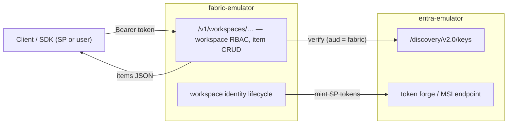

# 12 — Companion sketch: a Fabric control-plane emulator

> **Status: sketch, not committed work.** This documents a *separate future project*
> that would sit in front of entra-emulator. entra-emulator itself stays an Entra ID
> STS; roadmap #16 adds only the Entra-layer Fabric pieces (Fabric-audience tokens,
> a workspace-identity object, delegated Fabric scopes). Everything below is the part
> that is **not** Entra and therefore **not** in this repo.

## Why a companion, not a feature

A Microsoft Fabric environment layers two independent systems:

1. **Entra ID** — issues the tokens (service-principal client credentials for the Fabric
   audience; workspace identities that are auto-managed app registrations + service
   principals). *This is what entra-emulator emulates.*
2. **The Fabric control plane** — the `https://api.fabric.microsoft.com/v1/...` REST
   surface, workspace RBAC, item CRUD, the workspace-identity *lifecycle orchestration*,
   trusted workspace access, and OneLake storage. *This is a different product with a
   different protocol.*

Folding (2) into entra-emulator would change its character from "Entra STS" to "Fabric
clone" and balloon its scope. Keeping them as two composable emulators preserves the
single-responsibility boundary: **fabric-emulator validates bearer tokens against
entra-emulator's JWKS, exactly as real Fabric validates against Entra.**

## What the companion would emulate

Grounded in `fabric-docs`:

- **Token acceptance.** Validate `Authorization: Bearer` against entra-emulator's JWKS +
  issuer, accepting `aud` ∈ {`https://api.fabric.microsoft.com`,
  `https://analysis.windows.net/powerbi/api`}. Reuses our `ValidateAccessToken` model.
- **Workspace REST surface (subset).** `GET/POST/PATCH/DELETE /v1/workspaces`,
  `/v1/workspaces/{id}/items`, role assignments — enough for the automation smoke tests
  developers actually write (`data-warehouse/service-principals.md` walks the exact
  `list items` call).
- **Workspace RBAC.** Map a token's `oid`/`appid` to a workspace **role**
  (Admin/Member/Contributor/Viewer) and enforce it — the authorization decision Fabric
  makes that Entra does not.
- **Workspace-identity lifecycle.** Create/rename/delete a workspace → drive the matching
  entra-emulator workspace-identity object (name-follows-workspace, cascade delete, the
  `Active/Inactive/Deleting/Unusable/Failed/DeleteFailed` state enum,
  `Retrieved Fabric Identity Token for Workspace` audit event). When a Fabric item needs
  an outbound token, the companion asks entra-emulator to mint one for that identity —
  the customer never sees a credential, exactly as documented.
- **(Optional, later) A thin OneLake/ADLS-shaped surface** so trusted-workspace-access
  and shortcut scenarios can be smoke-tested end to end.

## Explicit non-goals for the companion

Capacity/SKU billing, the full Fabric item taxonomy (lakehouse/warehouse/KQL/notebook
engines), Power BI semantic-model evaluation, Purview audit, real networking/firewall
enforcement. The companion is a **control-plane contract emulator** for local dev/CI, not
a Fabric runtime.

## How the two projects stay decoupled

- entra-emulator exposes everything the companion needs through already-planned surfaces:
  JWKS (built), the workspace-identity object + its token minting (roadmap #16), the token
  forge (#2) and managed-identity endpoint (#3).
- The companion depends on entra-emulator **only over HTTP** (JWKS + a token-mint call) —
  no shared code, no shared process. It could even point at a real Entra tenant instead.
- Suggested home: a sibling repo `fabric-emulator`, or a `companion/fabric` module here
  that imports the public `emulator` package for in-process tests.

## Recommended sequencing

1. Ship roadmap #16 (Entra-layer Fabric identities) in entra-emulator — small, composes
   with #2/#3, independently useful for anyone doing SP → Fabric client credentials.
2. Only if there is real demand for control-plane testing, start the companion as its own
   project, consuming #16.
