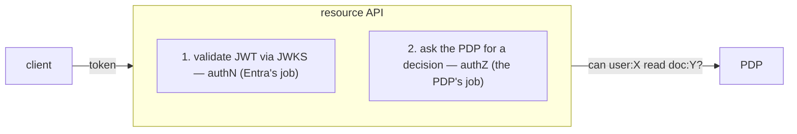
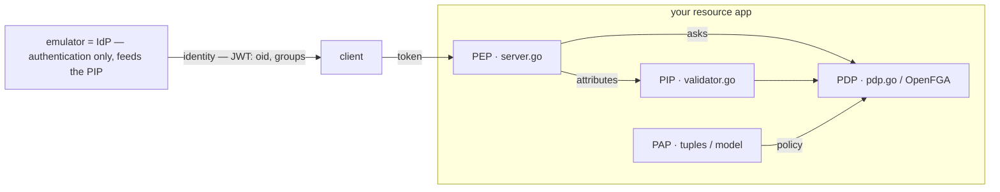

# Externalized authorization

Entra ID (and this emulator) **authenticates** — it proves *who* is calling and
that the token is genuine. It deliberately does **not** answer *may this
principal do this action on this object?* That fine-grained, data-dependent
question belongs to a separate **Policy Decision Point (PDP)** — OpenFGA, Casbin,
OPA, Cerbos, SpiceDB, Ory Keto, and the like.

The emulator lets you build and test that split **offline**: it issues
standards-compliant RS256 tokens with a real JWKS, so a resource API can validate
identity exactly as it would against cloud Entra, then delegate the decision to a
PDP — with no cloud tenant and no emulator-specific coupling.



The runnable reference lives in
[`samples/externalized-authz/`](https://github.com/calvinchengx/entra-emulator/tree/main/samples/externalized-authz).

## Why separate authN from authZ

- **Authentication** — *who is calling and is the token real?* Solved by
  validating the RS256 signature against the tenant [JWKS](05-oidc-endpoints.md),
  and checking `iss` / `aud` / `exp`. This is what an IdP is for.
- **Authorization** — *may this principal do this on this object?* A
  relationship- and data-dependent question that changes as your domain data
  changes. Baking it into the IdP couples your policy to your login provider and
  forces a token re-issue on every permission change. A dedicated PDP models it as
  data — e.g. OpenFGA tuples like `user:alice reader doc:readme`.

The token carries **identity** (`oid`) and **coarse context** (`groups`); the PDP
owns the policy. Neither side needs the other's internals — which is exactly why
the resource API needs no emulator-specific features.

## The four roles (PEP · PDP · PIP · PAP)

The classic authorization vocabulary (from XACML) splits the work into four
roles. The key thing to internalize: **the emulator is none of them.** It is the
**IdP** — it authenticates and issues identity claims. All four roles live in
*your* resource application and the PDP; the emulator only feeds them a
trustworthy identity.

| Role | Answers | In this sample | Emulator's part |
|---|---|---|---|
| **PEP** — Policy *Enforcement* Point | "intercept the call, ask, then allow or block" | `authz/server.go` — the `authorize()` middleware guarding each route | — |
| **PDP** — Policy *Decision* Point | "given the request + facts + policy: permit or deny?" | `authz/pdp.go` — the `PDP` port + `InMemoryPDP`; real OpenFGA/Casbin in `compat/` | — |
| **PIP** — Policy *Information* Point | "supply the attributes the decision needs" | `authz/validator.go` → `Claims`, mapped to `user:<oid>` + `group:<gid>` in `server.go` | **issues** `oid` / `groups` in the JWT — the emulator is the upstream attribute source |
| **PAP** — Policy *Administration* Point | "where policy / relationships are authored & stored" | `main.go` `pdp.Write(...)` seed; the OpenFGA model + tuples in `compat/` | — |



## What the emulator provides

Everything the resource server needs to authenticate, and nothing it needs to
authorize (by design):

| Claim / endpoint | Role |
|---|---|
| `discovery/v2.0/keys` (JWKS) | RS256 public keys, with rotation — the validator refreshes its cache on unknown `kid` |
| `iss` / `aud` / `exp` | standard issuer / audience / expiry checks |
| `oid` | stable object id → PDP **subject** (`user:<oid>`) |
| `groups` | group membership → PDP **usersets** (`group:<gid>#member`) |

Mint the access tokens for tests with the [admin token forge](14-testing-with-forged-tokens.md)
— no interactive sign-in required.

## The sample

[`samples/externalized-authz/`](https://github.com/calvinchengx/entra-emulator/tree/main/samples/externalized-authz)
is a small Go resource API built around a single seam — the `PDP` port:

| Piece | Role |
|---|---|
| `authz/validator.go` | JWKS-backed RS256 token validator (authN) |
| `authz/pdp.go` | the `PDP` port + an in-memory OpenFGA-style tuple checker (`InMemoryPDP`) |
| `authz/server.go` | protected API: authenticate, then PDP-check per route |
| `main.go` | standalone, env-configured runner |
| `main_test.go` | end-to-end test against the in-process emulator |

It runs with **zero external services** out of the box (the in-memory PDP), so
`go test ./...` covers the whole authN→authZ flow: direct-grant allow, no-grant
deny, group-derived allow, missing-token `401`, wrong-audience `401`.

```sh
# start the emulator, then:
EMULATOR_JWKS_URL=http://localhost:8080/<tenant>/discovery/v2.0/keys \
EMULATOR_ISSUER=http://localhost:8080/<tenant>/v2.0 \
RESOURCE_AUDIENCE=api://docs-api \
SEED_READER_OID=<alice-oid> \
go run ./samples/externalized-authz

curl -H "Authorization: Bearer $TOKEN" http://localhost:9090/documents/readme
```

## Worked example: trace one request

Follow a single call through all four roles. The runner seeds one relationship
(the **PAP** writing to the store):

```go
// main.go — author the policy (PAP)
pdp.Write("user:"+readerOID, "reader", "doc:readme")   // alice may READ readme
```

The routes declare what each needs (`server.go`): `GET /documents/{id}` requires
`reader`, `POST` requires `writer`.

**Allowed read** — alice's token, `GET`:

```sh
curl -H "Authorization: Bearer $ALICE_TOKEN" http://localhost:9090/documents/readme
# → 200 {"id":"readme","action":"read","subject":"<alice-oid>"}
```

What happened, role by role:

1. **PEP** (`authorize("reader", …)`) intercepts the request and pulls the bearer token.
2. **PIP** (`validator.Validate`) verifies the JWT against the emulator's JWKS and
   extracts `oid` + `groups` — the emulator, as IdP, is the source of those facts.
3. The PEP shapes the question: `Subject: "user:<alice-oid>"`, `Relation: "reader"`,
   `Object: "doc:readme"`, `Groups: ["group:<gid>", …]`.
4. **PDP** (`PDP.Check`) matches the seeded tuple → **permit**.
5. PEP lets the handler run → `200`.

**Denied write** — same token, `POST`:

```sh
curl -X POST -H "Authorization: Bearer $ALICE_TOKEN" http://localhost:9090/documents/readme
# → 403 {"error":"not permitted to writer doc:readme"}
```

Same identity, but the relation is now `writer` and no `writer` tuple exists, so
the **PDP denies** and the **PEP** returns `403` — the handler never runs.
Changing this is a **PAP** operation (write a `writer` tuple), *not* a token
change — the whole point of externalizing authorization.

Two more paths the sample proves:

- **Group-derived allow** — seed `group:<gid>#member reader doc:handbook`; any token
  whose `groups` claim contains `<gid>` is permitted, because the PEP passes the
  token's groups as usersets and the PDP matches on membership.
- **Rejected at the PEP** — a missing token → `401`; a token minted for a different
  audience → `401` (the PIP's `aud` check fails before the PDP is ever consulted).

## Proven against real engines

`InMemoryPDP` is a stand-in for teaching. To show the pattern isn't tied to it,
[`compat/`](https://github.com/calvinchengx/entra-emulator/tree/main/samples/externalized-authz/compat)
is a **PDP compatibility suite** that runs one canonical decision matrix against
real authorization engines through the same `PDP` port:

| Engine | Model | Runs as |
|---|---|---|
| **OpenFGA** | ReBAC (Zanzibar) | container (testcontainers) |
| **Casbin** | RBAC/ABAC | in-process (library) |

It asserts a single invariant: *given the same relationship facts and checks,
every adapter returns the same allow/deny matrix, and the full HTTP flow
(emulator token → JWKS validation → PDP → `200`/`403`) behaves identically
regardless of which engine is wired in* — which catches `oid`→subject and
`groups`→userset mapping bugs. Ory Keto / SpiceDB drop in as near-copies of the
OpenFGA harness; OPA / Cerbos follow the Casbin shape.

The two engines are CI-verified on every push by the **`pdp-compat`** job — a
matrix that runs Casbin in-process (no Docker) and OpenFGA via testcontainers —
so the compatibility claim is checked, not just asserted.

> **Honest caveat.** The canonical facts are ReBAC-shaped (subject / relation /
> object). For OpenFGA the translation is faithful and genuinely proves
> cross-engine equivalence. For Casbin we hand-author an equivalent model that
> yields the same decisions — so that leg proves *"our adapter + our authored
> model reproduce the contract,"* not that the engines are semantically
> identical.

## Swapping in a real PDP

Because everything routes through the `PDP` port, the resource server code does
not change — you replace `InMemoryPDP` with an engine adapter:

```go
// import openfga "github.com/openfga/go-sdk/client"
type openFGAPDP struct{ c *openfga.OpenFgaClient }

func (p *openFGAPDP) Check(ctx context.Context, req CheckRequest) (bool, error) {
    res, err := p.c.Check(ctx).Body(openfga.ClientCheckRequest{
        User: req.Subject, Relation: req.Relation, Object: req.Object,
    }).Execute()
    if err != nil { return false, err }
    return res.GetAllowed(), nil
}
```

Equivalent OpenFGA authorization model (DSL):

```
model
  schema 1.1
type user
type group
  relations
    define member: [user]
type doc
  relations
    define reader: [user, group#member]
    define writer: [user, group#member]
```

## Related

- [SCIM provisioning](15-scim-provisioning.md) — the other enterprise-integration
  surface: keep the PDP's *subjects* in sync by provisioning users/groups into it.
- [Testing with forged tokens](14-testing-with-forged-tokens.md) — how to mint the
  access tokens the resource API validates.
- [Token service](04-token-service.md) — the claims (`oid`, `groups`) the PDP maps
  from.
