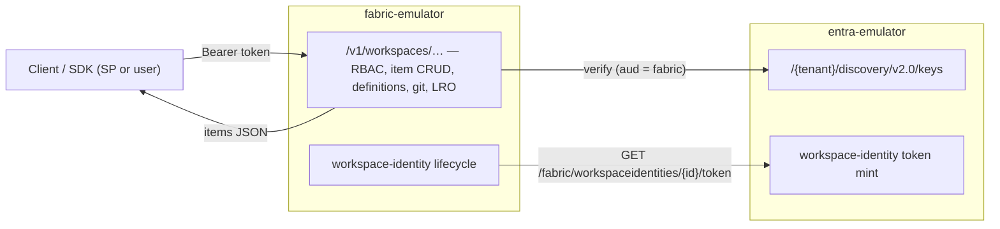

# 18 — Companion: the Fabric control-plane emulator

> **Status: the companion exists.** What this page originally sketched is now a
> real sibling project, **`fabric-emulator`** (`~/calvinchengx/fabric-emulator`,
> module `github.com/calvinchengx/fabric-emulator`), with its own design doc set:
> architecture, emulated API surface, and a P0–P3 roadmap. entra-emulator itself
> stays an Entra ID STS; roadmap [#16](17-roadmap.md) — the Entra-layer Fabric
> pieces (Fabric-audience tokens, the workspace-identity object, delegated
> Fabric scopes) — **has shipped**, and is exactly the surface the companion
> consumes.

## Why a companion, not a feature

A Microsoft Fabric environment layers two independent systems:

1. **Entra ID** — issues the tokens (service-principal client credentials for the Fabric
   audience; workspace identities that are auto-managed app registrations + service
   principals). *This is what entra-emulator emulates.*
2. **The Fabric control plane** — the `https://api.fabric.microsoft.com/v1/...` REST
   surface, workspace RBAC, item CRUD, the workspace-identity *lifecycle orchestration*,
   git integration, long-running operations, and OneLake storage. *This is a different
   product with a different protocol.*

Folding (2) into entra-emulator would change its character from "Entra STS" to "Fabric
clone" and balloon its scope. Keeping them as two composable emulators preserves the
single-responsibility boundary: **fabric-emulator validates bearer tokens against
entra-emulator's JWKS, exactly as real Fabric validates against Entra.**

## What entra-emulator provides to the companion (all shipped, #16)

- **Fabric-audience tokens.** `client_credentials` against
  `https://api.fabric.microsoft.com/.default` or the legacy
  `https://analysis.windows.net/powerbi/api/.default` (first-party app id
  `00000009-0000-0000-c000-000000000000`) mints a correct-`aud` token.
- **The workspace-identity object** (`internal/store/fabric.go`) — app
  registration + service principal with an emulator-managed credential, linked
  workspace name/GUID, name-follows-workspace, cascade delete, and the state
  enum `Active`/`Provisioning`/`Failed`/`Deprovisioning` (only `Active` mints).
  Admin CRUD at `/admin/api/workspace-identities`.
- **Internal token minting** at `GET /fabric/workspaceidentities/{id}/token` —
  the caller never handles a credential, like managed identity (#3).
- **Delegated Fabric scopes** auto-consented (`Fabric.Embed`, `Item.Read.All`,
  resource-prefixed forms) with aud=Fabric.
- **JWKS + issuer** for token validation — the same discovery surface every
  relying party uses.

## What the companion emulates (its repo is authoritative)

Workspaces + generic item CRUD, item definitions (the CI/CD parts format),
workspace RBAC (`Admin/Member/Contributor/Viewer`), git integration
(`connect`/`commitToGit`/`updateFromGit`/…), the `202` + `x-ms-operation-id`
long-running-operation contract on a controllable clock, connections, jobs, and
a thin OneLake/ADLS-Gen2 data plane with managed-folder enforcement. See
`fabric-emulator/docs/{01-architecture,02-api-surface,03-roadmap}.md`.

Its explicit non-goals: capacity/SKU billing, real compute (Spark/SQL/KQL
execution), Power BI semantic-model evaluation, Purview audit, network/firewall
enforcement — a **control-plane contract emulator**, not a Fabric runtime.

## How the two projects stay decoupled

- The companion depends on entra-emulator **only over HTTP**: JWKS + issuer for
  validation, and the workspace-identity admin API + token mint for lifecycle
  orchestration. No shared code, no shared process. It can point at a real
  Entra tenant instead.
- Local composition: the companion ships a `docker-compose.yml` that brings up
  both emulators, with entra advertising the compose-internal origin
  (`ORIGIN_MODE=compat` + `PUBLIC_ORIGIN`) so token `iss` matches what fabric
  validates.
- For Go integration tests it *may* import this repo's public
  [`emulator`](../emulator) package to run both in one process — an ergonomics
  option, not a coupling requirement.
