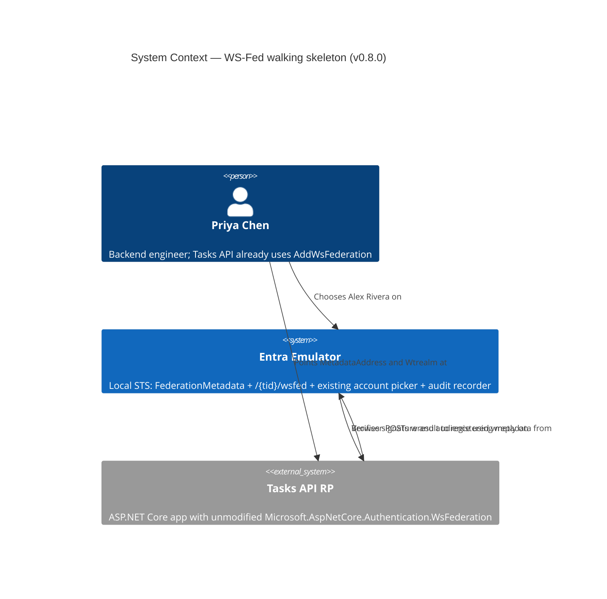
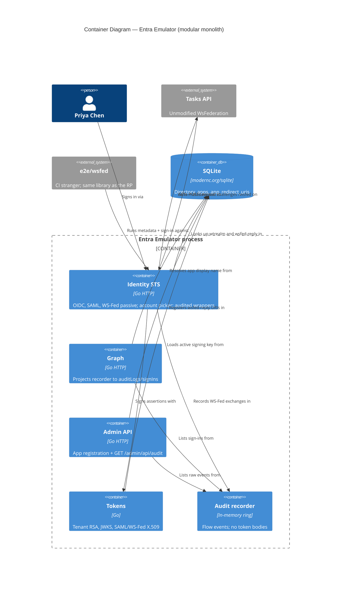
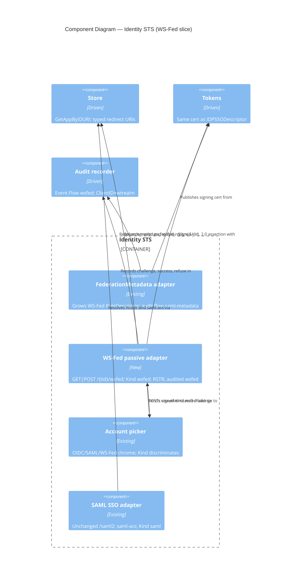

# Architecture brief — entra-emulator

**SSOT:** `docs/product/architecture/`  
**Bootstrapped:** 14 Aug 2026 (DESIGN wave, feature `ws-fed`)  
**Scope of this file:** Application architecture for WS-Federation passive sign-in. No System Architecture or Domain Model sections — those architects did not run.

This is a **local Entra emulator**: one process, one Identity STS surface, one SQLite directory. Success is an unmodified stranger completing the same wire conversation it completes against Entra, with only host and TLS knobs changed. It is not an identity-provider product, not a portal, and not a policy engine.

---

## Application Architecture

Feature: **`ws-fed`** (v0.8.0 walking skeleton). Job: point an existing ASP.NET WS-Fed relying party at the local STS (`docs/product/jobs.yaml`, journey `docs/product/journeys/ws-fed-sign-in.yaml`).

### Problem

Today FederationMetadata is SAML-only (`IDPSSODescriptor`) and `GET|POST /{tid}/wsfed` is unrouted (404). `Microsoft.AspNetCore.Authentication.WsFederation` cannot locate a `PassiveRequestorEndpoint` or complete sign-in. Priya Chen’s Tasks API already uses that library against Entra (`Wtrealm=api://tasks-api`, reply `https://rp.example.test/signin-wsfed`).

### Quality-attribute ranking (locked 14 Aug 2026)

| Rank | Attribute | Architectural implication |
|---|---|---|
| 1 | **Auditability** | Every WS-Fed exchange on `/{tid}/wsfed` is recorded in the **existing** in-process flow recorder **before** treating stranger CI as the only success signal. KPI-1 (unmodified WsFederation green) remains required; it is not a substitute for the recorder. |
| 2 | Interoperability | Unmodified `Microsoft.AspNetCore.Authentication.WsFederation` verifies metadata + `wresult`. |
| 3 | Maintainability | SAML analog: extend existing Identity / Store / Tokens / Audit; do not fork a second STS. |
| 4 | Security of the protocol surface | Registered `wreply` of type `wsfed-reply`; unknown `wtrealm` refused; unsolicited `wresult` refused; errors stay on the emulator (never bounce to an unowned URL). |
| 5 | Scale | Out of scope. Single-process emulator; no new deployable, no shard, no queue. |

ISO 25010 mapping: auditability → Security (accountability / non-repudiation) plus Maintainability (analyzability); interop → Compatibility; protocol-surface safety → Security (authorization of POST targets); scale is explicitly not a driver.

### Constraints

| Constraint | Impact |
|---|---|
| Solo maintainer, one Identity STS package | Conway: one process. Microservices would be 100% org-mismatch. |
| Walking skeleton **is** v0.8.0 (DISCUSS D3) | Metadata + `/wsfed` + picker + SAML 2.0 `wresult` + stranger in one cut; refuse-unsafe (US-06–08) still Must Have. |
| Spike S3b | `wresult` TokenType is SAML 2.0 (`…#SAMLV2.0`, assertion `Version="2.0"`). SharePoint / SAML 1.1 is out. |
| Spike H2 | Grow **existing** FederationMetadata URL; both `PassiveRequestorEndpoint` and `SecurityTokenServiceEndpoint` = `/{tid}/wsfed`. Hostname `sts.windows.net` is not required if assertion Issuer equals metadata entityID. |
| Existing `HasRedirectURI` ignores type | Must **not** be the WS-Fed reply check. |
| No SOAP, `/common/wsfed`, witnessed `wsignout1.0`, encryption, MFA/CA/Graph-as-sign-in, portal gallery | Explicit Won't-haves (DISCUSS D9 / story-map Release 2). |
| Tenant-agnostic examples | `{tid}`, `api://tasks-api`, `https://rp.example.test/signin-wsfed` only. |
| Paradigm | Go, OOP-native, match existing Identity handlers. Project `CLAUDE.md` is not edited. |

### Constraint and priority analysis

- **Largest bottleneck (Q1):** the protocol surface is missing (`/wsfed` 404 + SAML-only metadata). Scale is 0% of the problem. A new log store would address 0% extra auditability versus wrapping the existing recorder.
- **Constraint-free path:** extend Identity (SAML analog), Store type `wsfed-reply`, Tokens signing cert already used by SAML, Audit `audited` wrapper already used by `saml-sso`.
- **Primary focus:** Identity STS adapter + audit wrap of `/{tid}/wsfed`. Secondary: Store type filter, Graph projection so WS-Fed events remain identifiable, `e2e/wsfed` witness.
- **Do not invert:** shipping metadata alone (US-01 without US-04/US-05) or a green stranger without recorder events would invert the ranked drivers.

### Existing system analysis (reuse vs new)

Searched `internal/identity`, `internal/store`, `internal/tokens`, `internal/audit`, `internal/graph`, `e2e/`. **No new process, datastore, login UI, or SOAP listener.** Every new piece is justified by “no existing alternative that is safe to reuse.”

| Existing | Role today | WS-Fed decision |
|---|---|---|
| `Identity.Register` — `GET /{tenant}/federationmetadata/2007-06/federationmetadata.xml` wrapped `audited("saml-metadata", …)` | SAML-only EntityDescriptor + IDPSSODescriptor | **Grow this document** with WS-Fed `RoleDescriptor`. **Do not** add a second metadata URL. **Do not** rename the metadata audit flow (`saml-metadata` stays). |
| `GET\|POST /{tenant}/saml2` wrapped `audited("saml-sso", …)` | SAML SSO | **Not an alias.** New `GET\|POST /{tid}/wsfed` with its own audit flow name. |
| Signed picker state `Kind: "saml"` posting back to `/{tid}/saml2` | Same account picker as OIDC | New Kind (e.g. `"wsfed"`) posting back to `/{tid}/wsfed`. Same chrome (`renderAccountPicker` / password form). |
| Redirect type `saml-acs` (filtered in resolve; **not** `HasRedirectURI`) | SAML ACS allowlist | New type **`wsfed-reply`**. A SAML ACS must not accept a WS-Fed POST; an OIDC `web`/`spa` callback must not become a WS-Fed reply. |
| `GetAppByIDURI` | App lookup by Application ID URI | **Reuse** for `wtrealm`. |
| `HasRedirectURI` | Exact URI, **ignores type** | **Do not use** for WS-Fed. |
| `app_redirect_uris.type` (no DB CHECK; UNIQUE `(app_id, uri)`) | `web\|spa\|native` in comments; `saml-acs` already stored | Add allowed type `wsfed-reply`. Same URI cannot be two types on one app (existing uniqueness). Seed/docs in DELIVER. |
| Tenant RSA / X.509 (`tokens` SAML certificate, same key as JWKS) | IDPSSODescriptor + SAML assertion signature | **Same cert** on WS-Fed RoleDescriptor and assertion signature. No second key. |
| In-process audit ring buffer + `audited` wrapper | OIDC + SAML metadata/SSO | Wrap `GET\|POST /{tid}/wsfed`. Map `wtrealm` into `Event.ClientID` (documented). After picker, record the subject. Never persist raw `wresult`. |
| Graph `GET …/auditLogs/signIns` and Admin `GET /admin/api/audit` | Project the same recorder | WS-Fed events **must appear** here. No second log store. Projection must identify the app when `ClientID` holds an Application ID URI, and treat WS-Fed browser exchanges as interactive. |
| `e2e/saml` (Node `@node-saml/node-saml`) | SAML stranger | Analog only. New **`e2e/wsfed`**. |
| `e2e/dotnet` (MSAL.NET + Wilson OIDC) | OIDC/MSAL | **Do not extend.** Wrong protocol. |

**New (no existing alternative):** (1) WS-Fed RoleDescriptor on the existing metadata document; (2) `/{tid}/wsfed` passive sign-in adapter; (3) redirect type `wsfed-reply`; (4) signed-state Kind for WS-Fed; (5) RSTR envelope wrapping a SAML 2.0 assertion (SAML SSO posts `SAMLResponse`, not `wresult`); (6) `e2e/wsfed` .NET witness.

### Pattern

**Modular monolith with dependency inversion, as it already exists.** HTTP is the driving adapter; Store, Tokens, and Audit are driven ports. Default for a solo maintainer and a protocol sibling of SAML. Rejected simpler/heavier alternatives:

1. **Alias `/wsfed` onto `/saml2`** — rejected (DISCOVER D7 / DISCUSS): different binding and envelope; SharePoint rewrite exists because they are not aliases.
2. **New metadata URL** — rejected (H2 WORKS): stranger `MetadataAddress` is the existing FederationMetadata path.
3. **Second login UI** — rejected (US-03 / H4).
4. **New process or datastore** — rejected: scale out of scope; Conway mismatch; 0% of the bottleneck.
5. **In-process-Go-only stranger** — rejected: SAML v0.6.0 lesson; KPI-1 is the unmodified library.

### Component boundaries

| Component | Responsibility | Depends on (inward) | Must not |
|---|---|---|---|
| **Identity STS (driving HTTP adapter)** | Serve FederationMetadata; answer `wa=wsignin1.0` on `/{tid}/wsfed`; reuse picker; mint RSTR; refuse unsafe; wrap exchanges in audit | Store, Tokens, Audit | SOAP listener; `/common/wsfed`; second login chrome; trusting query-string `wreply` |
| **Store (driven)** | Apps by Application ID URI; redirect URIs including type `wsfed-reply` | SQLite | Protocol XML; signing |
| **Tokens / signing (driven)** | Same tenant RSA + derived X.509 used by SAML | Store keys | A second WS-Fed key |
| **Audit recorder (driven)** | In-process ring buffer of flow events | none (memory) | Raw `wresult` / assertion body |
| **Graph + Admin (driving HTTP, existing)** | Project recorder to `auditLogs/signIns` and `/admin/api/audit` | Audit, Store | A second audit table |
| **`e2e/wsfed` (CI witness, not runtime)** | Unmodified `Microsoft.AspNetCore.Authentication.WsFederation` completes metadata + sign-in | Emulator HTTP | Live in the emulator process; extending `e2e/dotnet` |

#### Ports (observable, not Go signatures)

**Driving (HTTP):**

| Port | Observable contract |
|---|---|
| FederationMetadata | `GET /{tid}/federationmetadata/2007-06/federationmetadata.xml` — EntityDescriptor grows `RoleDescriptor` `xsi:type="fed:SecurityTokenServiceType"` (WS-Federation). `IDPSSODescriptor` unchanged. Both `PassiveRequestorEndpoint` and `SecurityTokenServiceEndpoint` = `{login_origin}/{tid}/wsfed`. Sign-out advertised on the same PassiveRequestorEndpoint. Same signing cert bytes as IDPSSODescriptor. entityID remains emulator login origin + `/{tid}/`. Audit flow name stays `saml-metadata`. |
| WS-Fed passive STS | `GET\|POST /{tid}/wsfed` with `wa=wsignin1.0`. Unauthenticated valid challenge → HTTP 200 login HTML, **not** 302, **not** a `wresult`. After sign-in → HTTP 200 auto-POST HTML to **registered** `wreply`. Refuse-unsafe → 4xx (or emulator error page), **no** `Location` to an unowned URL. |
| Account picker | Same LOCAL EMULATOR / Pick an account (or existing password form). Signed state Kind distinguishes WS-Fed from SAML/OIDC; POST action is `/{tid}/wsfed`. |
| Admin audit | `GET /admin/api/audit` includes WS-Fed events. |
| Graph sign-ins | `GET /{tid}/v1.0/auditLogs/signIns` includes the same events. |

**Driven:**

| Port | Observable contract |
|---|---|
| App by ID URI | `wtrealm` → existing Application ID URI lookup. Miss → US-06 refuse. |
| Reply URIs by type | Accept `wreply` only if that app has an **exact** URI of type `wsfed-reply`. Missing / wrong type / other app’s URI → US-07 refuse. |
| Signing material | RoleDescriptor KeyDescriptor and assertion signature use the tenant cert already published on IDPSSODescriptor. |
| Recorder | Append events; list newest-first. No token body field. |

### Integration patterns and protocol contracts

Synchronous HTTP only. No message bus. Browser is the WS-Federation passive requestor.

**Happy path (US-01–US-05)**

1. RP fetches existing FederationMetadata as `MetadataAddress`.
2. Library maps `PassiveRequestorEndpoint` → TokenEndpoint = `/{tid}/wsfed` (also reads `SecurityTokenServiceEndpoint`).
3. Browser `GET` or `POST` `/{tid}/wsfed?wa=wsignin1.0&wtrealm=api://tasks-api&wreply=https://rp.example.test/signin-wsfed&wctx=…` ( `wctx` optional).
4. Emulator records a **challenge** event; returns login HTML.
5. Priya chooses Alex Rivera on the existing picker; challenge parameters survive.
6. Browser auto-POSTs to registered `wreply`: `wa=wsignin1.0`, `wresult` = RequestSecurityTokenResponse wrapping SAML 2.0 assertion, `wctx` echoed unchanged when present and omitted when the RP never sent it.
7. Unmodified WsFederation verifies; session at the Tasks API.
8. Emulator records a **success** event with the signed-in subject.

**Token shape (spike S3b, tenant-agnostic)**

| Field | Contract |
|---|---|
| TokenType | `http://docs.oasis-open.org/wss/oasis-wss-saml-token-profile-1.1#SAMLV2.0` (OASIS *profile* 1.1; assertion is SAML **2.0**) |
| Inner assertion | `Version="2.0"` `xmlns="urn:oasis:names:tc:SAML:2.0:assertion"` |
| Audience | equals `wtrealm` (`api://tasks-api`) |
| Issuer | equals metadata entityID (emulator login origin; `sts.windows.net` not required) |
| NameID Format | `urn:oasis:names:tc:SAML:2.0:nameid-format:persistent` (observed) |
| Signature | Verifiable with FederationMetadata signing cert (same as SAML) |

**Refuse-unsafe (US-06–US-08)** — errors stay on the emulator:

| Condition | Observable |
|---|---|
| Unknown or empty `wtrealm` | No `wresult` POST to caller `wreply`; recorded failure with concrete reason |
| Missing `wreply`, unregistered `wreply`, or `wreply` registered only as `saml-acs` / `web` / `spa` / other app | No `wresult` POST there; recorded failure with concrete reason |
| `wresult` without a prior challenge this STS issued (unsolicited / IdP-initiated) | Refused; no session via this STS; recorded failure. No v0.8.0 flag to allow it. |

**Unsolicited correlation (WHAT):** the STS delivers a `wresult` only after a challenge it issued (signed picker state Kind for WS-Fed). A token-shaped POST to `/{tid}/wsfed` that did not start here is refused. The locked stranger also defaults unsolicited logins off at the RP.

**Auditability contracts (rank 1)**

| Event | `Event.Flow` | `Event.ClientID` | Subject | `OK` / status | Body |
|---|---|---|---|---|---|
| Unauthenticated challenge (200 login HTML) | `wsfed` | `wtrealm` (Application ID URI) | empty | recorded; HTTP 200 is still a challenge event | **never** store HTML or `wresult` |
| Success after picker | `wsfed` | same | user id + UPN (`noteAuditSubject`) | success | **never** persist raw `wresult` |
| US-06 / US-07 / US-08 refuse | `wsfed` | attempted `wtrealm` when present | empty unless a user was already resolved | failure; **concrete `Reason`** | no token |

`Event.Flow` is already an open string in practice (`token`, `authorize`, `saml-sso`, `saml-metadata`). Document `wsfed` alongside those. Metadata GETs remain `saml-metadata`.

Graph `auditLogs/signIns` today resolves `appDisplayName` via app-GUID lookup on `ClientID` and marks interactive only when `Flow == "authorize"`. For WS-Fed, the projection must still identify the Tasks API when `ClientID` is an Application ID URI, and browser WS-Fed exchanges must appear as interactive. DISTILL asserts admin and Graph lists contain challenge, success, and refuse-unsafe events **without** logging the token body.

**Guardrails:** OIDC and SAML sign-in keep working. Growing FederationMetadata must not remove `IDPSSODescriptor`.

### C4 — System Context (L1)

### C4 — Container (L2)

Single OS process except the CI witness and the SQLite file.

### C4 — Component (L3) — Identity STS (compact)

### Technology stack (OSS first)

| Choice | License | Role | Rationale | Rejected |
|---|---|---|---|---|
| Go (existing 1.25) | BSD-style | Runtime language | OOP-native Identity handlers already exist | New service in another language |
| `encoding/xml` (stdlib) | BSD-style | FederationMetadata / RoleDescriptor | Same stack as current EntityDescriptor | New XML framework |
| Existing `goxmldsig` + `etree` | Apache-2.0 / BSD-2 | Assertion signature (SAML analog) | Already signs SAML 2.0 assertions this stranger’s handler can verify | Second signing stack |
| `modernc.org/sqlite` (existing) | BSD-3 | Directory + `app_redirect_uris` | No new datastore | Extra DB for WS-Fed |
| In-process audit ring (existing) | project / Go | Auditability #1 | Zero license cost; Graph already projects it | Second log store, SIEM product |
| `Microsoft.AspNetCore.Authentication.WsFederation` **unmodified** (witness only) | Apache-2.0 (MIT for some ASP.NET bits) | KPI-1 stranger | Locked witness; CI already installs .NET 8 | Fork the library; in-process Go-only; extend `e2e/dotnet` (OIDC/MSAL) |

No proprietary runtime. Seed of `wsfed-reply` and CI suite wiring are DELIVER/DEVOPS, not new licensed components.

### Architecture enforcement

**Style:** Modular monolith + ports-and-adapters (existing).  
**Language:** Go.  
**Tool:** No ArchUnit. Do **not** add a Java-style architecture test framework. Prefer the package-boundary discipline already used, plus existing Go tests and the `e2e/wsfed` stranger.

**Rules to keep (review + tests, optional `go-arch-lint` later — not required for v0.8.0):**

- Identity (HTTP adapter) may depend on Store, Tokens, Audit; Store must not import Identity.
- Tokens must not import Identity.
- Audit recorder stays payload-agnostic (no `wresult` field).
- WS-Fed reply checks filter on type `wsfed-reply`; they must not call type-blind `HasRedirectURI`.
- **Compliance gate:** no new top-level module, OS process, or datastore for WS-Fed. Extend Identity / Store type / Tokens cert / existing recorder only.

### Quality-attribute strategies

| Attribute | Strategy | Measurable |
|---|---|---|
| Auditability | `audited("wsfed")` on `/{tid}/wsfed`; `wtrealm` → `ClientID`; subject after picker; concrete `Reason` on refuse; never persist `wresult` | Admin + Graph lists show challenge, success, US-06/07/08 |
| Interoperability | H2 metadata shape + S3b SAML 2.0 RSTR + same cert + Issuer = entityID | `e2e/wsfed` green (KPI-1) |
| Maintainability | SAML analog: grow metadata, new Kind, new redirect type, same picker | OIDC/SAML e2e stay green; one metadata URL |
| Security | Type-filtered registered `wreply`; unknown realm refused; unsolicited refused; fail on emulator | KPI-5 negative e2e; no `Location` to attacker URL |
| Reliability | Unauthenticated GET is 200 HTML (spike: Entra does this), not a hang or premature token | US-02 |
| Performance / scale | Single-process; no extra hop | Out of scope |

**STRIDE (protocol surface, not a full product threat model):**

| Threat | Mitigation |
|---|---|
| Spoofing (forged realm) | `wtrealm` must match a registered Application ID URI |
| Tampering | Signed picker state; assertion signed with published cert |
| Repudiation | Recorder + Graph/Admin projection (primary driver) |
| Info disclosure | Never persist raw `wresult`; error pages stay on emulator |
| Elevation (open redirect token POST) | Exact `wsfed-reply` allowlist; cross-app reply refused |
| DoS | Scale out of scope; do not inflate unsolicited token XML as a success path |

### Deployment architecture

Unchanged: one emulator binary, one SQLite file, existing TLS. `e2e/wsfed` runs as a CI sibling of `e2e/saml` (see DEVOPS handoff). No new container or port.

### Story → component traceability

| Story | Components | Port |
|---|---|---|
| US-01 | Identity metadata adapter, Tokens | FederationMetadata GET |
| US-02 | WS-Fed adapter, Audit | `/{tid}/wsfed` challenge |
| US-03 | Account picker, signed Kind | Same login HTML family |
| US-04 | WS-Fed adapter, Store `wsfed-reply`, Tokens | Auto-POST `wresult` |
| US-05 | `e2e/wsfed` witness | Stranger session |
| US-06 | WS-Fed adapter, Store `GetAppByIDURI`, Audit | Refuse unknown realm |
| US-07 | WS-Fed adapter, typed redirect lookup, Audit | Refuse bad `wreply` |
| US-08 | WS-Fed adapter (challenge correlation), Audit | Refuse unsolicited |

### ADRs

| ADR | Decision |
|---|---|
| [ADR-001](adr-001-grow-existing-federationmetadata.md) | Grow existing FederationMetadata; no second URL |
| [ADR-002](adr-002-wsfed-reply-redirect-type.md) | New redirect type `wsfed-reply` |
| [ADR-003](adr-003-reuse-account-picker-kind.md) | Reuse picker via signed state Kind |
| [ADR-004](adr-004-audit-existing-recorder.md) | Audit WS-Fed through existing recorder; never log `wresult` |
| [ADR-005](adr-005-e2e-wsfed-sibling.md) | New `e2e/wsfed` sibling; do not extend `e2e/dotnet` |

### Handoff — DISTILL (acceptance-designer)

Acceptance on **ports**, not private structure:

1. **Metadata GET** — existing URL includes WS-Fed RoleDescriptor; both endpoints `/{tid}/wsfed`; cert matches IDPSSODescriptor; `IDPSSODescriptor` remains; audit flow name `saml-metadata`.
2. **Challenge** — `GET|POST /{tid}/wsfed` `wa=wsignin1.0` with registered realm/reply → HTTP 200 login HTML, not 404, not `wresult`.
3. **Picker** — same chrome as OIDC/SAML; `wtrealm` / `wreply` / `wctx` survive.
4. **`wresult` POST** — to registered `wsfed-reply` only; SAML 2.0 RSTR; Audience = `wtrealm`; Issuer = entityID; `wctx` echo rules; NameID format persistent.
5. **Audit list** — Admin `/admin/api/audit` and Graph `auditLogs/signIns` contain WS-Fed challenge, success (with user), and refuse-unsafe (with `Reason`); **no** token body in events. For `Flow=wsfed`, Graph identifies the app when `ClientID` is Application ID URI `api://tasks-api` (`appDisplayName` not blank) and marks the exchange interactive.
6. **Stranger** — unmodified WsFederation in `e2e/wsfed` completes sign-in (KPI-1).
7. **Refuse** — unknown `wtrealm`, missing/unregistered/`saml-acs`-only/`web`-only `wreply`, unsolicited `wresult`; no bounce to unowned URL.
8. **Guardrail** — existing OIDC e2e and **`e2e/saml` still pass after FederationMetadata grows the WS-Fed RoleDescriptor** (same suites, not a new witness). `IDPSSODescriptor` remains.

Examples stay tenant-agnostic: `{tid}`, `api://tasks-api`, `https://rp.example.test/signin-wsfed`.

### Handoff — DEVOPS (platform-architect)

Existing CI is enough to **start** DISTILL (in-process Go tests + manual stranger). Optional, recommended when the witness exists:

- Add an `e2e/wsfed` suite sibling of `e2e/saml` (register in `e2e/run.py`; include on the `sdk-e2e` job that already installs .NET 8).
- Do **not** fold WS-Fed into `e2e/dotnet`.
- No new deployable, port, secret store, or datastore.
- Do not log `wresult` in CI artifacts.
- Graph `auditLogs/signIns` URI/interactive mapping is **application** work (existing Graph adapter; DISTILL AC / DELIVER), not a new CI job or datastore.

**External integrations requiring contract tests:**

- `Microsoft.AspNetCore.Authentication.WsFederation` (metadata parse + `wresult` verification): the **`e2e/wsfed` stranger is the consumer-driven contract**. Pact is not required — the consumer is a CI library, not a separately deployed team API.

### Out of v0.8.0 (do not design)

SOAP / active WS-Trust; `/common/wsfed`; SharePoint / SAML 1.1 minting; witnessed `wsignout1.0`; IdP-initiated flag; token encryption; MFA / Conditional Access / B2C / portal gallery.
